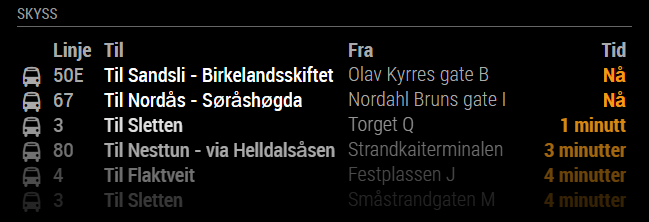
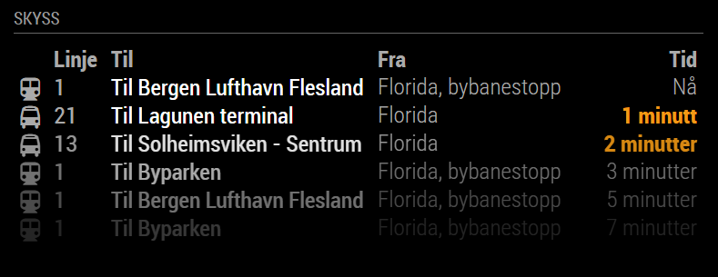

# MagicMirror² Module: Skyss
'MMM-Skyss' is a module based on the Ruter equivalent made by Cato Antonsen for displaying public transport information for the Hordaland region in Norway on a [MagicMirror²](https://magicmirror.builders/). It's using data from Skyss.no. Skyss is a registered trademark of Hordaland County Councile (Hordaland Fylkeskommune) which is not affiliated with this product. Content from Skyss APIs may be copyrighted.


 

Current version is 2.0.0 See [changelog](CHANGELOG.md "Version history") for version history.

## Installation

Remote to your MM2-box with your terminal software and go to your MagicMirror's Module folder:
````bash
cd ~/MagicMirror/modules
````

Clone the repository:
````bash
git clone https://github.com/AndreasFroyland/MMM-Skyss.git
````

Go to the modules folder:
````bash
cd MMM-Skyss
````

Install the dependencies:
````bash
npm install
````

Add the module to the modules array in the `config/config.js` file by adding the following section. You can change this configuration later when you see this works:
```javascript
{
	module: 'MMM-Skyss',
	header: 'Skyss',
	position: 'top_left',
	config: {
		showPlatform: true,
		maxItems: 8,
		stops: [
			{
				stopId: "55861",
				stopGroupId: "32379"
			},
			{
				stopId: "55863",
				stopGroupId: "32379"
			}
		]
	}
},
```

**Note:** You can use either just the numeric IDs (e.g., `"55861"`) or the full IDs with prefixes (e.g., `"NSR:Quay:55861"`). The module will automatically add the `NSR:Quay:` and `NSR:StopPlace:` prefixes if needed.

# Configuration options

These are the valid configuration options you can put inside the config array above:

Configuration option | Comment | Default 
---|---|---
stops | Array of stops. See below | Empty array
maxItems | Number of journeys to display | 5 
showHeader | Set this to true to show header above the journeys | false
showStopName | Display custom stop name for each stop. You can override the name by adding `stopName` to the stop you want to override (See below) | false
maxNameLength | Some stop names can be very long and ruin the layout of the module. Set this to how many characters you max want to display.  | Not set
showPlatform | Set this to true to get the names of the platforms. Set this to true to check the name of the platform if you need to filter  | false
humanizeTimeTreshold | If time to next journey is below this value, it will be displayed as "x minutes" instead of time | 15 
serviceReloadInterval | Refresh rate in MS for how often we call Skyss's web service. NB! Don't set it too low! | 30000 
animationSpeed | How fast the animation changes when updating mirror - in milliseconds | 0  
fade | Set this to true to fade list from light to dark | true  
fadePoint | Start fading on 1/4th of the list | 0.25
useRealtime | Use realtime (DisplayTime) when available instead of only scheduled time | true
debug | Enable verbose console logging for troubleshooting | false

## Skyss API v3 Migration (IMPORTANT)
The module now uses the new Skyss API v3 endpoint:

Endpoint: https://skyss.giantleap.no/v3/departures (HTTP POST)

Old (deprecated) GET requests with `/public/departures?Hours=...&StopIdentifiers=...` are no longer used.

### New Request Body Format
The request body sent to the API looks like this:
```json
{
  "stopGroups": [
    {
      "id": "NSR:StopPlace:32379",
      "stops": [
        { "id": "NSR:Quay:55861" },
        { "id": "NSR:Quay:55863" }
      ]
    }
  ]
}
```
The module automatically builds this structure by grouping all configured stops by their `stopGroupId`.

### ID Shortcuts
You may provide either:
- Full IDs: `NSR:Quay:55861` / `NSR:StopPlace:32379`
- Numeric only: `55861` / `32379` (prefixes are auto-added)

### Alternative Grouped Configuration
Instead of listing each quay as a separate object you can group them:
```javascript
stops: [
  {
    stopGroupId: "32379",
    stopIds: ["55861", "55863"]
  }
]
```
This produces the exact same request body as listing each quay separately.

## Stops
You have to configure at least one stop. The module now uses the new Skyss v3 API which requires both a `stopId` (Quay ID) and a `stopGroupId` (StopPlace ID).

### How to find Stop (Quay) and Stop Group (StopPlace) IDs
1. Go to https://avgangsvisning.skyss.no/
2. Add the stop(s) you are interested in so the live board loads.
3. Open your browser Developer Tools (F12) and select the Network tab.
4. (Optional) Reload the page or wait for data refresh.
5. Filter network requests by the term `departures` or `/v3/departures`.
6. Click the POST request to `https://skyss.giantleap.no/v3/departures`.
7. In the Request Payload you will see a JSON body containing:
   - `stopGroups` array
   - Each object has an `id` (this is the `StopPlace` ID)
   - Inside `stops` you find each `Quay` with its `id`.
8. Copy the numeric parts or the full IDs for use in your configuration.

Example extracted from payload:
```json
{
  "stopGroups": [
    {
      "id": "NSR:StopPlace:32379",
      "stops": [ { "id": "NSR:Quay:55861" }, { "id": "NSR:Quay:55863" } ]
    }
  ]
}
```
Configuration using numeric shortcut:
```javascript
stops: [
  { stopId: "55861", stopGroupId: "32379" },
  { stopId: "55863", stopGroupId: "32379" }
]
```
Grouped form equivalent:
```javascript
stops: [
  { stopGroupId: "32379", stopIds: ["55861", "55863"] }
]
```

Stop option | Comment 
---|---
stopId | Numeric Quay ID (e.g., `"55861"`) or full ID (e.g., `"NSR:Quay:55861"`)
stopIds | (Alternative grouped config) Array of quay IDs belonging to the same stopGroupId
stopGroupId | Numeric StopPlace ID (e.g., `"32379"`) or full ID (e.g., `"NSR:StopPlace:32379"`)

**Note:** Multiple quays usually share the same StopPlace. Always pair every quay with the correct stopGroupId or use the grouped form.

## Debugging
Set `debug: true` in the module config to print:
- Built request body & grouped stop structure
- API response status (in node helper)
- Number of passing times returned
- Realtime vs scheduled selection per journey

Example:
```javascript
{
  module: 'MMM-Skyss',
  position: 'top_left',
  config: {
    debug: true,
    maxItems: 8,
    stops: [ { stopGroupId: '32379', stopIds: ['55861','55863'] } ]
  }
}
```

## Translations

This modules is translated to the following languages:

Language | Responsible
---|---
nb (Norwegian) | Cato Antonsen
en (English) | Cato Antonsen

If you add other languages, please make a PR or drop me a line!

# Future enhancements
1. Show deviations
1. Add filter for departures that are too close to make
